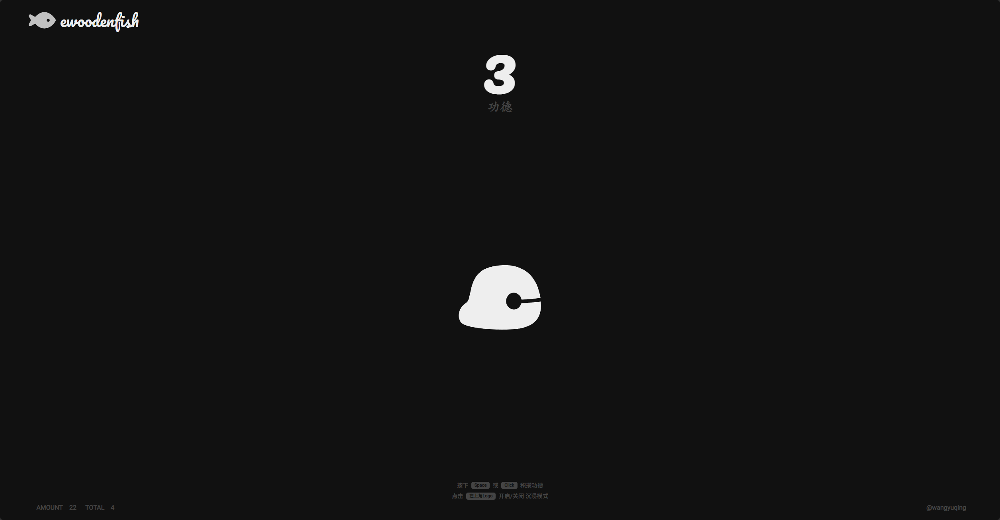

# 🪵 电子木鱼（全局计数版）

一个基于 Web 的电子木鱼，支持**所有用户共享点击计数**，使用 Flask + Gunicorn + SQLite 构建，支持 Docker 一键部署。



## ✨ 特性

- 🌐 所有用户点击次数全局累计
- 📦 轻量级：单文件后端 + SQLite
- 🐳 完整 Docker 支持（含 Gunicorn 生产服务器）
- 🔒 非 root 用户运行，数据持久化
- 🎵 保留原有前端交互（音效、动画等）

## 🚀 快速开始

### 前提条件

- Docker
- Docker Compose

### 部署步骤

```bash
# 1. 克隆项目
git clone https://github.com/CharlesWYQ/ewoodfish.git
cd ewoodfish

# 2. 启动服务
docker-compose -f docker/docker-compose.yml up -d --build

# 3. 访问 http://localhost:8000